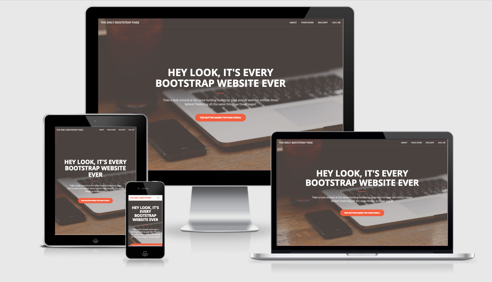

# Preamble

In 2011, Ethan Marcotte with his book titled, [‘Responsive Web Design’](https://abookapart.com/products/responsive-web-design) showed us the power of fluid grids, flexible images, and media queries. How to use them to craft web pages that worked across different sizes of screens. The content, text, images, and other media, responded to the size of the screens (viewport), enabled the user to access them irrespective of the screen size and interaction methods (mouse or touch based interactions).

Till then, PSD-to-HTML workflow served us well in making beautiful sites. The complexity of the responsive web design (RWD) brought the PSD-to-HTML production lines to a grinding halt. Our learning so far with web design based on the desktop-centric browsing seemed not adequate for the new responsive web design. We came across new problems like: mouse pointers vs fat finger, hover states, screen sizes, connection speeds, device capabilites etc.

> “Photoshop comps is the most effective way to show your clients what their website will never look like.”
  —Stephen Hay

Some smart people out there who understood the nuts and bolts of the responsive web design built frameworks such as Twitter Bootstrap[^1] and Foundation. Folks like us, followed their lead and started making responsive sites using the frameworks. 

Fast forward some years. We came to realize some problems with using frameworks in making sites. They all started look-alike. Our super smart engineering teams started complaining that Bootstrap makes their frontend code far too bloated. Less than 20% of the CSS code were actually needed, and the rest of the code were useless. It started hitting the performance of the our sites. 

Designers started complaning that the Bootstrap is killing their _creativity_. We all started to forget that each of our web projects are unique in thier own way. We realized how we were sacrificing the brand’s visual language and styles just to make the site to responsive. Both designers and engineers started to think in the frameworks instead of the interfaces and HTML/CSS.

Why did we adopted these responsive frameworks in the first place? They werw easy to learn. They made our jobs faster. They came with all the pieces to we needed – typography, buttons, forms, layouts, anitmations, etc.

## _What do we need?_

We need our own tiny bootstraps[^2] tailored for our products. They should built with our project and design language needs. They should be flexible and scalable. That’s what we are going to build by the end of this workshop.

[^1]: We are not focusing on Twitter Bootstrap. The arguments are valid to all responsive frameworks out there.
[^2]: [Responsive Deliverables](http://daverupert.com/2013/04/responsive-deliverables/)
